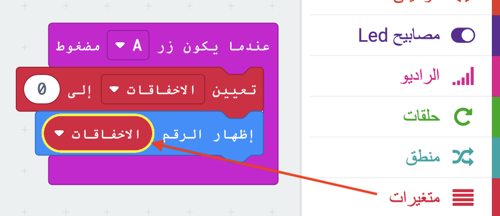

## تخزين الإخفاقات

لنبدأ بإنشاء مكان لتخزين عدد الإخفاقات.

+ اذهب إلى<a href="https://rpf.io/microbit-new" target="_blank">rpf.io/microbit-new </a> للبدأ بمشروع جديد في محرر إنشاء الكودات (PXT)MakeCode. سمي مشروعك الجديد 'الإحباط'.

+ احذف الكتل ` إلى الأبد` و ` عند بدء` بسحبها إلى اللوحة:

+ اللعبة الجديدة يجب أن تبدأ عندما يضغط اللاعب على زر A. اضغط على 'ادخال' و ثم `عندما يكون زر A مضغوط`.

+ الآن تحتاج إلى متغير لتخزين عدد مرات الاخفاقات في اللعبة بواسطة لمس السلك بالعصا. اضغط على 'متغيرات' و ثم 'إنشاء متغير'. سمي المتغير`اخفاقات`.

+ اسحب كتلة `تعيين` من 'المتغيرات' و إختر `اخفاقات`:

ذلك سيحدد عدد الاخفاقات إلى صفر عند الضغط على الزر A.

+ اخيرًا، يمكنك عرض عدد`الاخفاقات` على جهاز المايكروبت الخاص بك. للقيام بذلك، اولًا اسحب كتلة `اظهار الرقم` من ' اساسي' إلى نهاية النص البرمجي الخاص بك.

+ ثم اسحب `الاخفاقات` من 'المتغيرات' إلى `كتلة تعيين`.

+ انقر فوق 'تشغيل' لاختبار الكود الخاص بك. النقر على الزر A يجب ان يعرض عدد الاخفاقات التي تم تعيينها إلى `0`.

