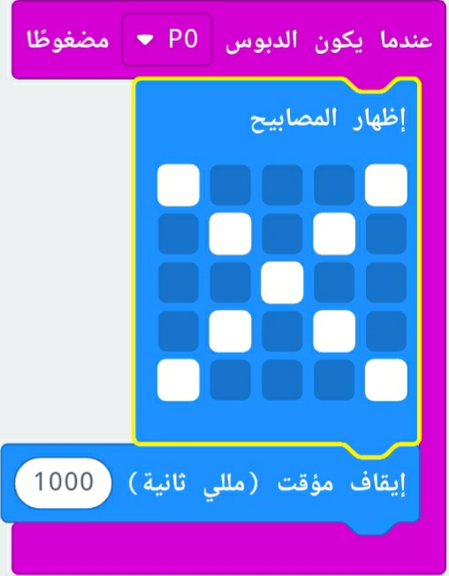
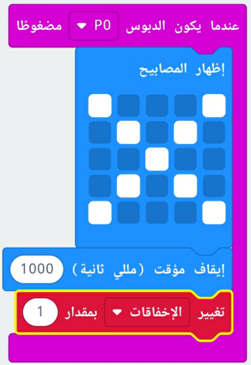

## تتبع الإخفاقات

لنضيف كود لتتبع الإخفاقات.

+ ستقوم بإضافة 1 إلى المتغير `الإخفاقات` في كل مرة يتم الاتصال على Pin0. للقيام بذلك، اسحب `عندما يكون الدبوس P0 مضغوطا` من 'الادخال'.

+ بعد ذلك، أضف كتلتين لعرض علامة الخطأ لثانية واحدة عندما يضغط على الدبوس Pin0.

+ ستحتاج بعد ذلك إلى إضافة 1 إلى متغير `الاخفاقات` الخاص بك. لإضافة ذلك، اسحب`تغيير عنصر بمقدار 1` من المتغيرات و تغيير `العنصر` إلى `الإخفاقات`. 

+ اخيرًا، يمكنك اضافة الكود لعرض عدد الاخفاقات المحدثة. إليك كيفية ظهور تعليماتك البرمجية.

+ اختبر الكود الخاص بك بالضغط على الزر A على المحاكي لبدأ لعبتك. في كل مرة تضغط فيها على الدبوس Pin0 يجب أن ترى متغير `الإخفاقات` يزداد بمقدار واحد.

+ انقر على 'تحميل' و انقل نصك البرمجي إلى جهاز المايكروبت الخاص بك micro:bit. يمكنك الضغط على الدبوس Pin0 لأكمال الدائرة. للقيام بذلك، ضع ابهامك الايمن على أرضية الدبوس (GND) و انقر فوق Pin0 بأبهامك الايسر.

