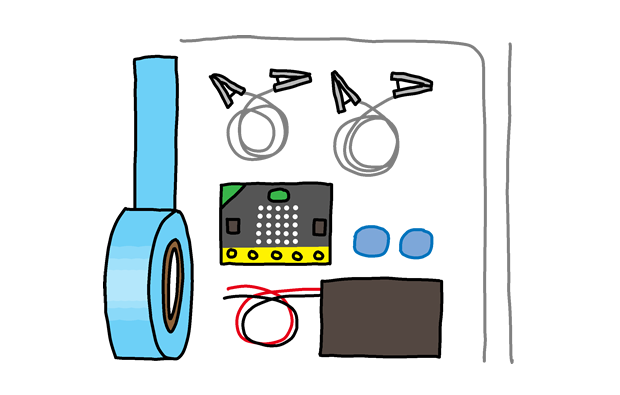

## Introducció

You are going to make a game in which players have to guide a wand along a course without making contact. Making contact will add one to the player's score - the player with the lowest score wins!

**Instructions**: If you're reading this online, press **A** on the micro:bit below to start the game, and then touch pin **0** to make a connection.

<iframe style="position:absolute;top:0;left:0;width:100%;height:100%;" src="https://makecode.microbit.org/---run?id=_FEDEdA3v6e64" allowfullscreen="allowfullscreen" sandbox="allow-popups allow-scripts allow-same-origin" frameborder="0"></iframe>

For this project you'll need some additional items:

* Metal wire (approx. 50cm);
* Modelling clay (Plasticine or similar, needs to be non-conductive);
* Electrical tape (optional);
* Crocodile clip leads (optional).

### Informació addicional per als líders del club

Si necessites imprimir aquest projecte, si us plau utilitza la [versió per a imprimir](https://projects.raspberrypi.org/en/projects/frustration/print).

## \--- collapse \---

## títol: notes del líder del club

## Introducció:

In this project, children will learn how to use variables in making a wire-following game. The aim of the game is to guide a wand along a course without making contact. Making contact will add one to the player's score - the player with the lowest score wins.

## Recursos

To complete this project, children will need:

* Metal wire (approx. 50cm);
* Putty;
* Electrical tape (optional);
* Crocodile leads (optional).

Steps 1 and 2 of this project can be completed without this equipment.

For this project, the [MakeCode (PXT)](http://jumpto.cc/pxt-new) microbit editor should be used.

You can find a completed version of this project at [makecode.microbit.org/#pub:71088-38400-20107-39742](https://makecode.microbit.org/#pub:71088-38400-20107-39742), and the compiled .hex file can be downloaded by clicking the 'Download Project Materials' link for this project, which contains:

* Frustration.hex

## Objectius d'aprenentatge

* Les variables;
* Input/output (I/O) pins.

Aquest projecte cobreix elements de les següents línies del [Raspberry Pi Digital Making Curriculum](http://rpf.io/curriculum):

* [Utilitza les construccions de programació bàsiques per crear programes senzills.](https://www.raspberrypi.org/curriculum/programming/creator)

* [Use basic digital, analogue, and electromechanical components.](https://www.raspberrypi.org/curriculum/physical-computing/creator)

## Reptes

* "Display an image" - Display an image on the micro:bit before the number of `fails` is displayed.
* "Cheat mode!" - Subtract 1 from the `fails` variable when button B is pressed.
* "Personalise your game" - Make changes to the wand and course in order to make the game more difficult.

\--- / collapse \---

## \--- collapse \---

## títol: materials del projecte

## Recursos del líder del club

* [online completed project](https://makecode.microbit.org/#pub:71088-38400-20107-39742)
* [.hex project file to transfer onto your micro:bit](resources/micro-bit-Frustration.hex)

\--- / collapse \---