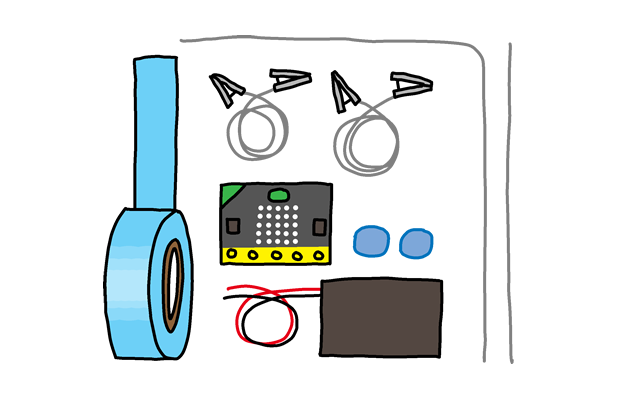

## Cyflwyniad

Rydych chi am wneud gêm lle mae'n rhaid i chwaraewyr arwain hudlath ar hyd cwrs heb wneud cyswllt. Bydd gwneud cyswllt yn ychwanegu un i sgôr y chwaraewr – mae'r chwaraewr gyda'r sgôr isaf yn ennill!

**Cyfarwyddiadau**: Os ydych yn darllen hwn ar-lein, gwasgwch **A** ar y micro:bit isod i gychwyn y gêm, ac yna cyffwrdd â'r pin **0** i wneud cysylltiad.

<iframe style="position:absolute;top:0;left:0;width:100%;height:100%;" src="https://makecode.microbit.org/---run?id=71088-38400-20107-39742" allowfullscreen="allowfullscreen" sandbox="allow-popups allow-scripts allow-same-origin" frameborder="0"></iframe>

Ar gyfer y prosiect hwn bydd angen rhai eitemau ychwanegol arnoch chi:

* Gwifren fetel (tua 50cm);
* Clai modelu (plastisin neu debyg, mae angen iddo beidio â bod yn ddargludol);
* Tâp trydanol (dewisol);
* Gwifrennau clip crocodeil (dewisol).

### Gwybodaeth ychwanegol ar gyfer arweinwyr clwb

Os oes angen i chi argraffu'r prosiect hwn, defnyddiwch y fersiwn [hwylus i'w argraffu](https://projects.raspberrypi.org/cy-GB/projects/frustration/print).

--- collapse ---
---
title: Nodiadau arweinwyr clwb
---
## Cyflwyniad:

Yn y prosiect hwn, bydd y plant yn dysgu sut i ddefnyddio newidynnau wrth wneud gêm dilyn gwifren. Nod y gêm yw arwain hudlath ar hyd cwrs heb gysylltu. Bydd gwneud cyswllt yn ychwanegu un i sgôr y chwaraewr – mae'r chwaraewr gyda'r sgôr isaf yn ennill.

## Adnoddau

I gwblhau'r prosiect hwn, bydd angen y canlynol ar y plant:

* Gwifren fetel (tua 50cm);
* Pwti;
* Tâp trydanol (dewisol);
* Gwifrennau clip crocodeil (dewisol).

Gellir cwblhau Camau 1 a 2 o'r prosiect hwn heb yr offer hwn.

Ar gyfer y prosiect hwn, dylid defnyddio'r golygydd microbit [MakeCode (PXT)](http://jumpto.cc/pxt-new).

Gallwch ddod o hyd i fersiwn wedi'i gwblhau o'r prosiect hwn ar [makecode.microbit.org/#pub:71088-38400-20107-39742](https://makecode.microbit.org/#pub:71088-38400-20107-39742) , a gellir lawrlwytho'r ffeil .hex wrth glicio ar y ddolen 'Lawrlwytho Deunyddiau Prosiect' ar gyfer y prosiect hwn, sy'n cynnwys:

* Frustration.hex

## Amcanion Dysgu

* Newidynnau;
* Piniau mewnbwn / allbwn (I / O).

Mae'r prosiect hwn yn cwmpasu elfennau o'r ffrydiau dilynol o'r [Cwricwlwm Creu Digidol Raspberry Pi](http://rpf.io/curriculum):

* [Defnyddio lluniadau rhaglennu sylfaenol i greu rhaglenni syml.](https://www.raspberrypi.org/curriculum/programming/creator)

* [Defnyddio cydrannau digidol, analog, ac electrofecanyddol sylfaenol.](https://www.raspberrypi.org/curriculum/physical-computing/creator)

## Heriau

* 'Dangoswch ddelwedd' - Dangoswch ddelwedd ar y micro: bit cyn y bydd y nifer o `methiannau` yn cael eu harddangos.
* 'Modd twyllo!' – Mae tynnu 1 o'r newidyn `methiannau` yn amrywio pan fo botwm B yn cael ei wasgu.
* "Personoli'ch gêm" - Gwneud newidiadau i'r hudlath a chwrs er mwyn gwneud y gêm yn fwy anodd.

--- /collapse ---

---collapse---
---
title: Deunyddiau prosiect
---
## Adnoddau arweinwyr clwb

* [prosiect wedi'i gwblhau ar-lein](https://makecode.microbit.org/#pub:71088-38400-20107-39742)
* [ffeil prosiect.hex i'w throsglwyddo i'ch micro:bit](resources/micro-bit-Frustration.hex)

--- /collapse ---