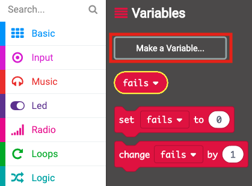
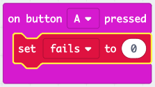

## Storio methiannau

Gadewch i ni ddechrau trwy greu lle i storio nifer y methiannau.

+ Go to <a href="https://rpf.io/microbit-new" target="_blank">rpf.io/microbit-new</a> to start a new project in the MakeCode (PXT) editor. Galwch eich prosiect newydd yn 'Frustration'.

+ Dilëwch y blociau `forever` (am byth) a `start` (dechrau) trwy eu llusgo i'r palet:

+ Dylai gêm newydd ddechrau pan fydd y chwaraewr yn gwasgu botwm A. Cliciwch 'Input' (Mewnbwn) ac yna ` on button A pressed ` (pan wasgir botwm A).

+ Nawr mae angen newidyn arnoch i gadw'r nifer o weithiau y byddwch chi'n methu yn y gêm trwy gyffwrdd â'r wifren â'r hudlath. Cliciwch ar 'Variables' (Newidynnau) ac yna 'Make a new Variable' (Gwneud Newidyn Newydd). Enwch y newidyn yn `methiannau`.

+ Llusgwch floc `set` o 'Variables' (Newidynnau) a dewis `methiannau`:

Bydd hyn yn gosod nifer y methiannau i ddim pan fyddwch yn gwasgu botwm A.

+ Yn olaf, gallwch ddangos y nifer y `methiannau` ar eich micro:bit. I wneud hyn, yn gyntaf llusgwch floc `show number` (dangos nifer) o 'Basic' (Sylfaenol) i ddiwedd eich sgript.

+ Yna llusgwch `methiannau` o 'Variables' (Newidynnau) i mewn i'ch `set block` (bloc gosod).

+ Cliciwch 'run' (rhedeg) i brofi eich sgript. Dylai glicio botwm A arddangos nifer y methiannau, sydd wedi'u gosod i `0`.

