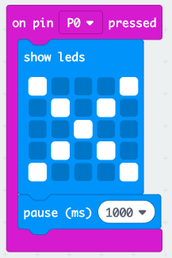
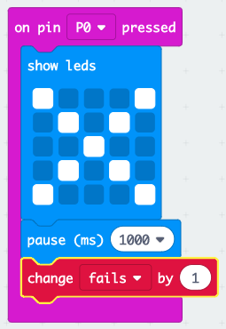

## Cadw cofnod o fethiannau

Gadewch i ni ychwanegu cod i gadw golwg ar fethiannau.

+ Rydych chi'n mynd i ychwanegu 1 at eich newidyn `methiannau` bob tro y gwneir cysylltiad ar Pin0 I wneud hyn, llusgwch `on pin P0 pressed` (pan wasgir pin P0) o 'Input' (Mewnbwn).

+ Nesaf, ychwanegwch 2 floc i arddangos croes ar gyfer 1 eiliad pan fo Pin0 yn cael ei wasgu.

+ Yna bydd angen i chi ychwanegu 1 at eich newidyn `methiannau`. I wneud hyn, cliciwch ar lusgo `change item by 1` (eitem newid erbyn 1) o Newidynnau a newid `eitem` i `fethu`. 

+ Yn olaf, gallwch ychwanegu cod i ddangos nifer y methiannau wedi'i ddiweddaru. Dyma sut y dylai eich cod ymddangos.

+ Profwch eich cod trwy wasgu botwm A ar yr efelychydd i gychwyn eich gêm. Pob tro y byddwch chi'n gwasgu Pin0, dylech weld eich newidyn `methu` yn cynyddu o 1.

+ Cliciwch 'Download' (Lawrlwytho) a throsglwyddwch eich sgript ar eich micro:bit. Gallwch wasgu Pin0 trwy gwblhau cylched. I wneud hyn, rhowch eich bawd de ar y pin daear (GND) ac yna tapiwch Pin0 gyda'ch bawd chwith.

