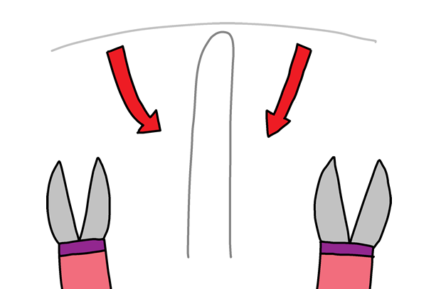

## Adeiladu eich gêm

Nawr eich bod wedi codio eich gêm, gadewch i ni ei roi i gyd gyda'i gilydd!

+ Yn gyntaf, gadewch i ni wneud eich hudlath. Cymerwch ddarn o wifren tua 20cm o hyd a'i blygu yn ei hanner, gan wneud dolen ar y brig.

+ Gallwch chi wedyn droi'r ddau ddarn o wifren gyda'i gilydd.

+ I wneud y cwrs, cymerwch ddarn arall o wifren tua 30cm o hyd a phlygu rhan ganol y wifren i siâp. Dylech blygu un pen o'r cwrs i fyny.

+ Os oes gennych rywfaint o dâp trydan, lapiwch ychydig o amgylch dau ben y wifren, gan adael rhywfaint o fetel agored ar y ddau ben.

+ Llithrwch eich hudlath trwy'ch cwrs, a gwthiwch bennau'ch gwifren i mewn i bwti i'w gael i sefyll.

+ Gallwch nawr gysylltu eich gêm at â'ch micro:bit gan ddefnyddio gwifren glip crocodeil neu ychydig o wifren. Yn gyntaf, cysylltwch y pin daear (GND) i un pen o'ch cwrs.

+ Yna gallwch chi gysylltu Pin 0 â'ch hudlath.

+ Profwch eich gêm. Gwasgwch fotwm A a dylai eich sgôr gael ei osod i 0. Pob tro mae'ch hudlath yn cyffwrdd â'r cwrs, cwblheir y cylched a dylai eich micro:bit ychwanegu 1 at nifer eich methiannau.

