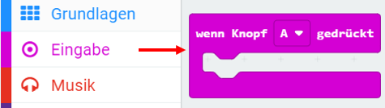
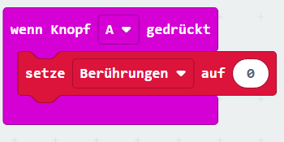
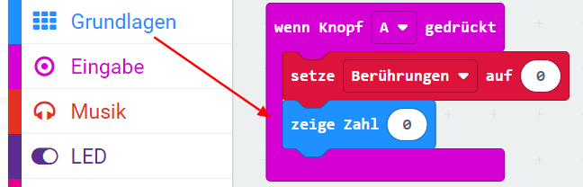
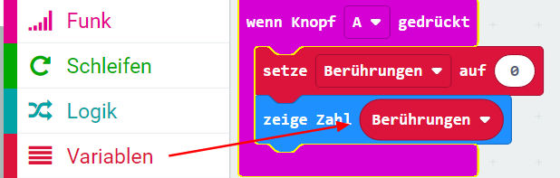

## Berührungen speichern

Beginnen wir mit der Erstellung eines Speicherorts für die Anzahl der Berührungen.

+ Rufe <a href="https://rpf.io/microbit-new" target="_blank">rpf.io/microbit-new</a> auf, um ein neues Projekt im MakeCode (PXT) -Editor zu starten. Nenne dein neues Projekt "Frustration".

+ Lösche die `für immer` und `starte` Blöcke, indem du sie auf die Palette ziehst:

+ Ein neues Spiel sollte beginnen, wenn du die Taste A drückst. Klicke auf 'Eingabe' und dann auf `Taste A gedrückt`.

+ Jetzt benötigst du eine Variable, um zu speichern, wie oft du den Draht mit dem Zauberstab berührt hast. Klicke auf "Variablen" und dann auf "Neue Variable erstellen". Nenne die Variable `Berührungen`.

+ Ziehe einen `setze-` Block aus 'Variablen' und wähle `Berührungen`:

Dadurch wird die Anzahl der Berührungen auf Null gesetzt, wenn du die A-Taste drückst.

+ Schließlich kannst du die Anzahl der `Berührungen` auf deinem micro:bit anzeigen. Ziehe dazu zuerst einen `Zeige-Nummer-` Block von 'Basic' an das Ende deines Skripts.

+ Ziehe dann `berührungen` aus 'Variablen' in deinen `Setze-Block`.

+ Klicke auf "Ausführen", um dein Skript zu testen. Durch Klicken auf die Schaltfläche A sollte die Anzahl der Berührungen angezeigt werden, die vorher auf `0` gesetzt wurde.

