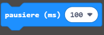

--- challenge ---

## Herausforderung: Zeige ein Bild an

Kannst du ein Bild für 1 Sekunde (1000 ms) anzeigen, bevor die Anzahl von `Berührungen` angezeigt wird?

Dazu musst du die folgenden Blöcke von Basic verwenden:

--- /challenge ---