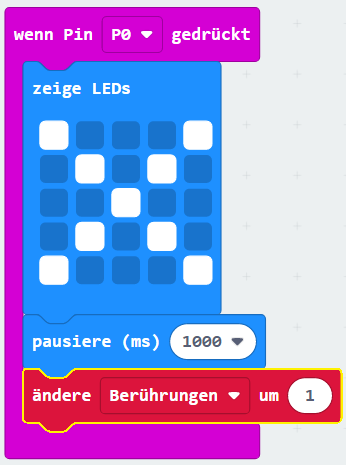
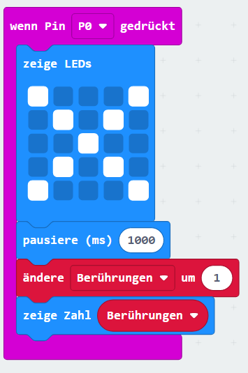

## Das Verfolgen von Berührungen

Lass uns Code hinzufügen, um Berührungen zu zählen.

+ Jedes Mal, wenn an PIN0 eine Verbindung hergestellt wird, wirst du 1 zu deiner `Berührungen`-Variable hinzuzählen. Ziehe dazu `Pin P0 gedrückt` aus 'Input'.

+ Füge als nächstes 2 Blöcke hinzu, um 1 Sekunde lang ein Kreuz anzuzeigen, wenn Pin0 gedrückt wird.

+ Du musst 1 zu deiner `Berührungen`-Variable hinzuzählen. Um das zu tun, ziehen ein `ändere um 1`-Block aus Variablen und ändere das `Element` auf `Berührungen`. 

+ Schließlich kannst du Code hinzufügen, um die neue Anzahl von Berührungen anzuzeigen. So sollte dein Code aussehen.

+ Teste deinen Code, indem du die Taste A am Emulator drückst, um das Spiel zu starten. Jedes Mal, wenn du Pin0 drückst, sollte deine `Berührungen`-Variable sich um 1 erhöhen.

+ Klicken auf "Herunterladen" und übertrage dein Skript auf deinen micro:bit. Du kannst Pin0 drücken, indem du einen Stromkreis schließt. Lege dazu deinen rechten Daumen auf den Masseanschluß (GND) und tippe dann mit deinem linken Daumen auf Pin0.

