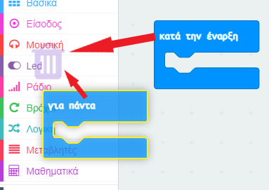
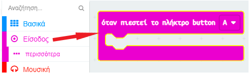
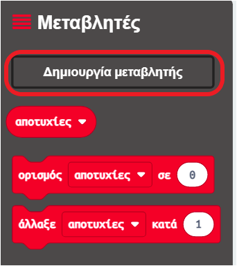
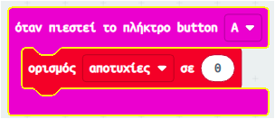
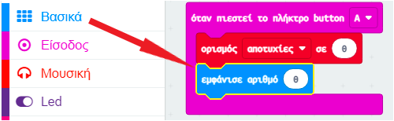
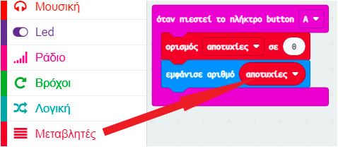

## Αποθήκευση αποτυχιών

Ας ξεκινήσουμε δημιουργώντας ένα μέρος για την αποθήκευση του αριθμού των αποτυχιών.

+ Πήγαινε στο <a href="https://rpf.io/microbit-new" target="_blank">rpf.io/microbit-new</a> για να ξεκινήσεις ένα νέο έργο στον επεξεργαστή MakeCode (PXT). Ονόμασε το νέο σου έργο «Διαδρομή για γερά νεύρα».

+ Διάγραψε τα μπλοκ `για πάντα` και `κατά την έναρξη` σύροντάς τα στην παλέτα των μπλοκ:

+ Ένα νέο παιχνίδι θα πρέπει να αρχίζει όταν ο παίκτης πατά το κουμπί A. Κάνε κλικ στο μενού «Είσοδος» και στη συνέχεια στο μπλοκ `όταν πιεστεί το πλήκτρο button A`.

+ Τώρα χρειάζεσαι μια μεταβλητή για να αποθηκεύσεις τον αριθμό των φορών που αποτυγχάνεις στο παιχνίδι όταν αγγίζεις το σύρμα με το ραβδί. Κάνε κλικ στο μενού 'Μεταβλητές' και μετά κλικ στο μπλοκ 'Δημιουργία Μεταβλητής'. Ονόμασε τη μεταβλητή `αποτυχίες`.

+ Σύρε ένα μπλοκ `ορισμός σε` από το μενού 'Μεταβλητές' και επίλεξε `αποτυχίες`:

Αυτό θα ορίσει τον αριθμό των αποτυχιών σε μηδέν όταν πατήσεις το κουμπί A.

+ Τέλος, μπορείς να εμφανίσεις τον αριθμό των `αποτυχιών` στο micro:bit σου. Για να το κάνεις αυτό, πρώτα σύρε ένα μπλοκ `εμφάνισε αριθμό` από το μενού "Βασικά" στο τέλος του script σου.

+ Στη συνέχεια, σύρε το `αποτυχίες` από το "Μεταβλητές" στο μπλοκ `εμφάνισε αριθμό`.

+ Πάτησε 'εκτέλεση' (έναρξη προσομοιωτή) για να δοκιμάσεις το script σου. Κάνοντας κλικ στο κουμπί A θα εμφανιστεί ο αριθμός των αποτυχιών, ο οποίος έχει οριστεί σε `0`.

