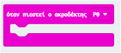
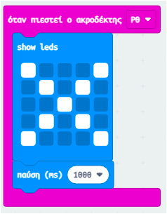
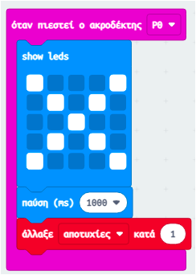
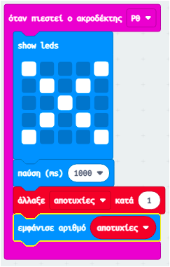

## Καταγράφοντας τις αποτυχίες

Ας προσθέσουμε κώδικα για να καταγράφουμε τις αποτυχίες.

+ Θα προσθέτεις 1 στη μεταβλητή `αποτυχίες` κάθε φορά που γίνεται σύνδεση στο Pin0. Για να το κάνεις αυτό, σύρε το μπλοκ `όταν πιεστεί ο ακροδέκτης P0 ` από το μενού 'Είσοδος'.

+ Στη συνέχεια, πρόσθεσε 2 μπλοκ για να εμφανιστεί ένας σταυρός για 1 δευτερόλεπτο όταν πατηθεί το Pin0.

+ Θα χρειαστεί να προσθέσεις 1 στη μεταβλητή `αποτυχίες`. Για να το κάνεις αυτό, σύρε ένα μπλοκ `άλλαξε κατά 1` από το μενού Μεταβλητές και επίλεξε τη μεταβλητή `αποτυχίες` ως το `στοιχείο` που θα αλλάξει. 

+ Τέλος, μπορείς να προσθέσεις κώδικα για να εμφανίσεις τον ενημερωμένο αριθμό αποτυχιών. Ο κώδικάς σου πρέπει να είναι κάπως έτσι.

+ Δοκίμασε τον κώδικά σου πατώντας το κουμπί Α στον προσομοιωτή για να ξεκινήσεις το παιχνίδι σου. Κάθε φορά που πατάς το Pin0 θα πρέπει να βλέπεις ότι η μεταβλητή `αποτυχίες` αυξάνεται κατά 1.

+ Κάνε κλικ στη «Λήψη» και μετάφερε το script σου στο micro:bit. Μπορείς να πατήσεις το Pin0 για να κλείσει ένα κύκλωμα. Για να το κάνεις αυτό, τοποθέτησε τον δεξί σου αντίχειρα στον ακροδέκτη γείωσης (GND) και στη συνέχεια πάτησε το Pin0 με τον αριστερό σου αντίχειρα.

