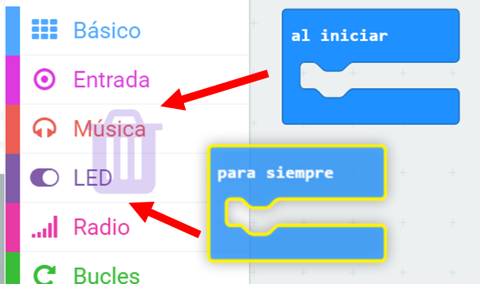
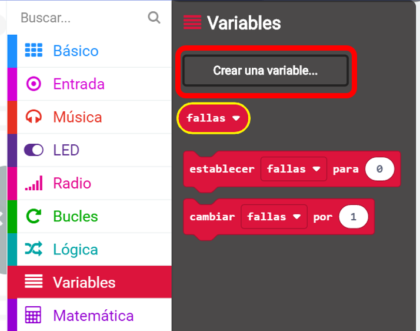
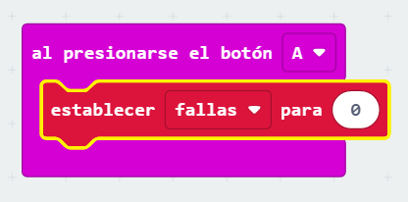
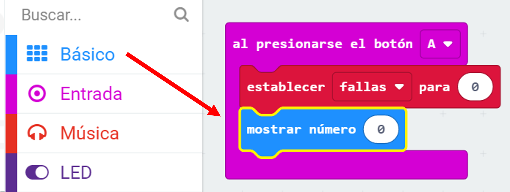
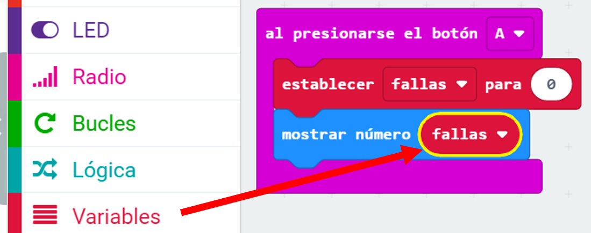
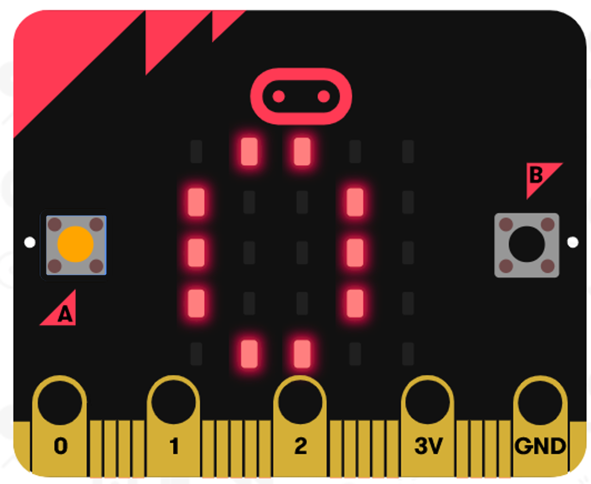

## Almacenando las fallas

Comencemos creando un lugar para almacenar el número de fallas.

+ Ve a <a href="https://rpf.io/microbit-new" target="_blank"> rpf.io/microbit-new </a> para comenzar un nuevo proyecto en el editor MakeCode (PXT). Llama a tu nuevo proyecto 'Frustracion'.

+ Elimina los bloques `para siempre` y `comenzar` arrastrándolos a la paleta:

+ Cuando el jugador o la jugadora presiona el botón A debe comenzar un nuevo juego. Haz clic en 'Entrada' y luego `al presionar el botón A`.

+ Ahora necesitas una variable para almacenar la cantidad de veces que fallas en el juego tocando el cable con la varita. Haz clic en 'Variables' y luego en 'Crear una nueva variable'. Nombra la variable `fallas`.

+ Arrastra un bloque `establecer` desde 'Variables' y selecciona `fallas`:

Esto establecerá el número de fallas a cero cuando presionas el botón A.

+ Finalmente, puedes mostrar el número de `fallas` en tu micro:bit. Para hacer esto, primero arrastra un bloque `mostrar número` desde 'Básico' hasta el final de tu secuencia de comandos.

+ Luego arrastra `fallas` desde 'Variables' a tu `bloque establecer`.

+ Haz clic en 'ejecutar' para probar tu secuencia de comandos. Al hacer clic en el botón A debería aparecer el número de fallas, que se ha establecido en `0`.

