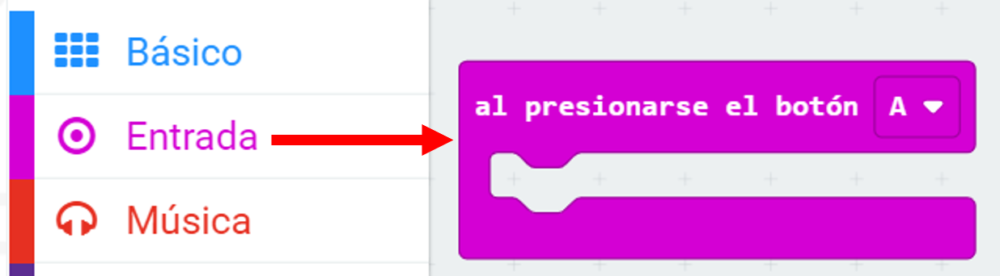

## Fallo en el almacenamiento

Comencemos creando un lugar para almacenar el número de fallas.

+ Vaya a <a href="https://rpf.io/microbit-new" target="_blank"> rpf.io/microbit-new </a> para comenzar un nuevo proyecto en el editor MakeCode (PXT). Llame a su nuevo proyecto 'Frustración'.

+ Eliminar los bloques `para siempre` y `comenzar` arrastrándolos a la paleta:

+ Un nuevo juego debe comenzar cuando el jugador ó la jugadora presiona el botón A. Haga clic en 'Entrada' y luego ` en el botón A presionado `.

+ Ahora necesitas una variable para almacenar la cantidad de veces que fallas en el juego tocando el cable con la varita. Haga clic en 'Variables' y luego en 'Crear una nueva variable'. Nombre la variable `fallas`.

+ Arrastre un bloque `conjunto` desde 'Variables' y seleccione `fallas`:

Esto establecerá el número de fallas a cero cuando presionar el botón A.

+ Finalmente, puede mostrar el número de `fallas` en tu micro:bit. Para hacer esto, primero arrastre un bloque `mostrar número` desde 'Básico' hasta el final de su secuencia de comandos.

+ Luego arrastre `fallas` desde 'Variables' a su `bloque de conjunto`.

+ Click 'run' to test your script. Al hacer clic en el botón A debería aparecer el número de fallas, que se ha establecido en `0`.

