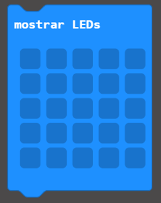
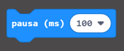

\--- challenge \---

## Challenge: Display an image

¿Puede mostrar una imagen por 1 segundo (1000ms) antes de que se muestre el número de `fallos`?

Necesitará usar los siguientes bloques de Basic para hacer esto:

\--- /challenge \---