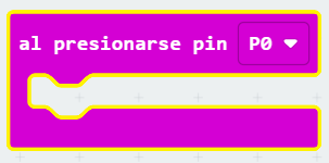
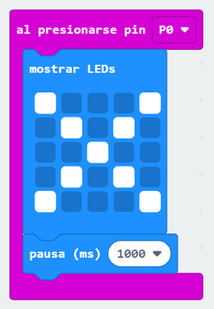
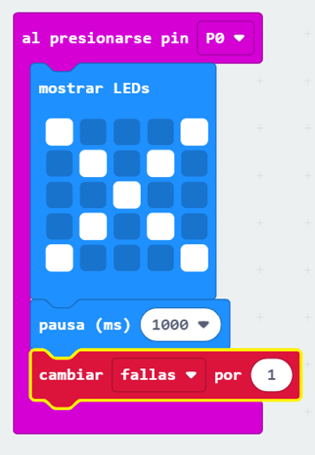
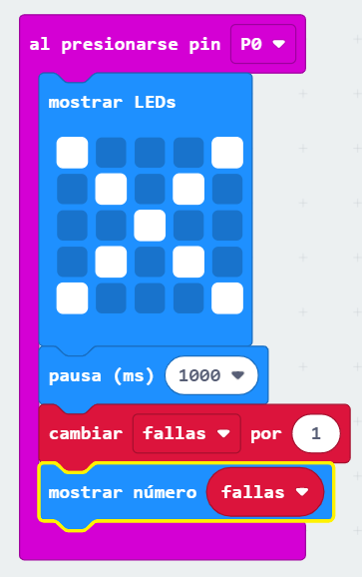
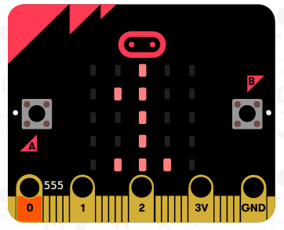

## Seguimiento de fallas

Agreguemos un código para realizar un seguimiento de los errores.

+ Vas a agregar un 1 a tu variable ` fallas` cada vez que se realiza una conexión en Pin0. Para hacer esto, arrastra ` al presionar pin P0 ` desde 'Entrada'.

+ Luego, agrega 2 bloques para mostrar una cruz durante 1 segundo cuando se presiona Pin0.

+ Luego deberás agregar 1 a tu variable ` fallas`. Para hacer esto, arrastra un `cambiar objeto por 1` de Variables y cambia `objeto` a `falla`. 

+ Finalmente, puedes agregar un código para mostrar el número actualizado de fallas. Así es como debería verse tu código.

+ Prueba tu código presionando el botón A en el emulador para comenzar tu juego. Cada vez que presiones Pin0 deberías ver un aumento de tu variable `fallas` en 1.

+ Haz clic en 'Descargar' y transfiere tu secuencia de comandos a tu micro: bit. Puedes presionar Pin0 completando un circuito. Para hacer esto, coloca el pulgar derecho en el pin de tierra (GND) y luego toca Pin0 con el pulgar izquierdo.

