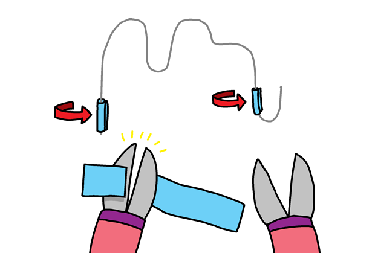

## Construyendo tu juego

Ahora que has programado tu juego, ¡vamos a armarlo!

+ Primero, hagamos tu varita. Toma un trozo de alambre de unos 20 cm de largo y dóblalo por la mitad, formando un lazo en la parte superior.

+ Luego puedes torcer los dos trozos de alambre juntos.

+ Para hacer el curso, toma otra pieza de alambre de unos 30 cm de largo y dobla la parte central del alambre para darle forma. Debes doblar un extremo del curso.

+ Si tienes cinta aislante, envuelve un poco alrededor de los dos extremos del cable, dejando un poco de metal expuesto en ambos extremos.

+ Desliza tu varita a través de tu curso, y empuja los extremos de tu cable en masilla para ponerlo de pie.

+ Ahora puedes conectar tu juego a tu micro:bit usando un cocodrilo o un cable. En primer lugar, conecta el pin tierra (GND) a un extremo de tu curso.

+ Luego puedes conectar el Pin 0 a tu varita.

+ Prueba tu juego. Presiona el botón A y tu puntaje debería establecerse a 0. Cada vez que tu varita toca el curso, el circuito se completa y tu micro:bit debería agregar un 1 a tu número de fallas.

