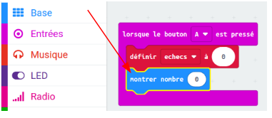

## Stocker les échecs

Commençons par créer un endroit où stocker le nombre d'échecs.

+ Va sur <a href="https://rpf.io/microbit-new" target="_blank">rpf.io/microbit-new</a> pour démarrer un nouveau projet dans l'éditeur MakeCode (PXT). Appelle ton nouveau projet « Frustration ».

+ Supprime les blocs `toujours` et `au démarrage` en les faisant glisser vers la palette :

+ Une nouvelle partie commence quand le joueur appuie sur le bouton A. Clique sur « Entrée », puis `lorsque le bouton A est pressé`.

+ Maintenant tu as besoin d'une variable pour stocker le nombre de fois où tu vas échouer en touchant le fil avec la baguette. Clique sur « Variables », puis « Créer une variable ». Nomme la variable `echecs`.

+ Place un bloc `définir ... à` depuis « Variables » et sélectionne `echecs` :

Ceci mettra à zéro le nombre d'échecs quand on appuie sur le bouton A.

+ Enfin, tu peux afficher le nombre d'`échecs` sur ton micro:bit. Pour cela, place un bloc `montrer nombre`, depuis « Base », à la fin du script.

+ Ensuite place `echecs` depuis « Variables » dans le bloc `montrer nombre`.

+ Clique sur « lancer » pour tester ton script. Cliquer sur le bouton A devrait afficher le nombre d'échecs, qui a été mis à `0`.

