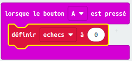

## Stocker les échecs

Commençons par créer un endroit où stocker le nombre d'échecs.

+ Va sur <a href="http://jumpto.cc/pxt-new" target="_blank">jumpto.cc/pxt-new</a> pour démarrer un nouveau projet dans l'éditeur PXT.
  Appelle ton nouveau projet 'Frustration'.

+ Supprime les blocs `toujours` et `au démarrage ` en les déplaçant sur la palette, dans la corbeille&nbsp;:

+ Une nouvelle partie commence quand le joueur appuie sur le bouton A.
  Clique sur 'Entrée', puis `lorsque le bouton A est pressé`.

+ Maintenant tu as besoin d'une variable pour stocker le nombre de fois où tu vas échouer et toucher le fil avec la baguette.
  Clique sur 'Variables', puis 'Créer une variable'.
  Nomme la variable `échecs`.

+ Place un bloc `définir ... à` depuis 'Variables' et sélectionne `échecs`&nbsp;:

Ceci mettra à zéro le nombre d'échecs quand on appuie sur le bouton A.

+ Enfin, tu peux afficher le nombre d'`échecs` sur ta micro:bit.
  Pour cela, place un bloc `montrer nombre`, depuis 'Basique', à la fin du script.

+ Ensuite place `échecs` depuis 'Variables' dans le bloc `montrer nombre`.

+ Clique sur 'lancer' pour tester ton script.
  Cliquer sur le bouton A devrait afficher le nombre d'échecs, qui a été mis à `0`.

