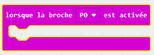
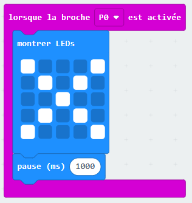
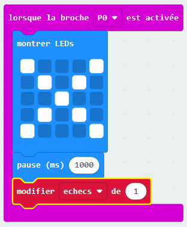
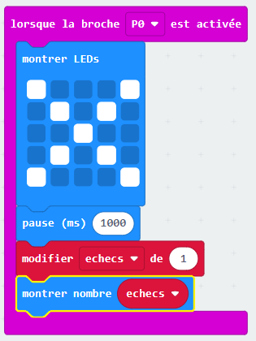

## Compter le nombre d'échecs

Ajoutons le code qui compte le nombre d'échecs.

+ Tu vas ajouter 1 à la variable `fails` chaque fois qu'une connexion est faite sur la broche P0.
  Pour cela, prend un bloc `lorsque le pin P0 est pressé` dans 'Entrées'.

+ Ensuite, ajoute 2 blocs pour afficher une croix pendant 1 seconde lorsque la broche P0 est pressée.

+ Tu devras ensuite ajouter 1 à la variable `échecs`.
  Pour cela, prend un bloc `changer item par 1` dans 'Variables' et remplace `item` par `échecs`.

+ Enfin, tu peux ajouter le code pour afficher le nombre d'`échecs` mis à jour.
  Voilà à quoi devrait ressembler ton code.

+ Teste ton code en appuyant sur le bouton A de l'émulateur pour démarrer le jeu.
  Chaque fois que tu appuies sur la broche P0, tu devrais voir la variable `échecs` augmenter de 1.

+ Clique sur 'Télécharger' et transfère ton script sur ta micro:bit.
  Tu peux appuyer sur la broche P0 en fermant le circuit.
  Pour cela, place ton pouce droit sur la masse (broche GND) et touche la broche P0 avec ton pouce gauche.

