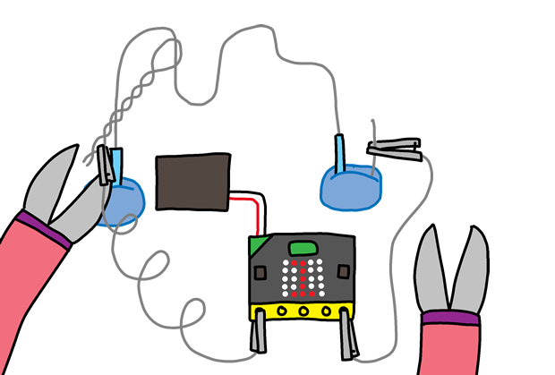

## Construit ton jeu

Maintenant que tu as programmé ton jeu, assemblons tout ensemble&nbsp;!

+ D'abord, créons une baguette.
  Prend un morceau de fil de fer d'environ 20cm de long et replie-le en deux, en créant un boucle à l'extrémité.

+ Tu peux ensuite entortiller les 2 extrémités du fil ensemble.

+ Pour faire le circuit, prend une autre morceau de fil d'environ 30cm de long et tord la partie centrale du fil pour lui donner une forme biscornue.
  Tu devras tordre vers le haut une des extrémités du circuit.

+ Si tu as du ruban adhésif isolant, enveloppe les 2 extrémités du circuit,
  en laissant dépasser un peu de métal à chacune des extrémités.

+ Enfile ta baguette sur le circuit, et pique une des extrémités du fil dans la pâte à modeler pour que le circuit tienne debout tout seul.

+ Tu peux brancher ton jeu à ta micro:bit en utilisant des pinces crocodiles.
  Connecte d'abord la masse (broche GND) à l'une des extrémités du circuit.

+ Tu peux ensuite connecter la broche P0 à ta baguette.

+ Teste ton jeu.
  Appuie sur le bouton A et ton score sera remis à 0.
  Chaque fois que ta baguette touche le circuit, le courant passe entre la baguette et le circuit et ta micro:bit ajoute 1 au nombre d'échecs.

