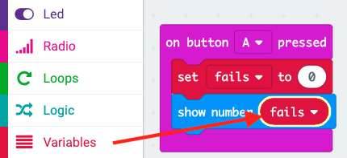

## भंडारण विफल रहता है

आइए विफलताओं की संख्या का भंडारण करने के लिए कोई जगह बनाकर शुरू करते हैं।

+ MakeCode (PXT) संपादक में एक नया प्रोजेक्ट शुरू करने के लिए <0>rpf.io/microbit-new</0> पर जाएंँ।. अपने नए प्रोजेक्ट का नाम 'निराशा' रखें।

+ `forever` (हमेशा के लिए) और `start` (आरंभ) ब्लॉकों को पैलेट में खींचकर हटाएँ:

+ जब खिलाड़ी बटन A दबाता है तो एक नया गेम शुरू होना चाहिए। 'Input' ('इनपुट') पर क्लिक करें और फिर `on button A pressed` (बटन A दबाए जाने पर) पर क्लिक करें।

+ अब आपको एक वेरिएबल की आवश्यकता है जिसमें छड़ी से तार को छूकर गेम में विफल होने की संख्या का भंडारण किया जा सके । 'Variables' ('वेरिएबल्स') पर क्लिक करें और फिर 'Make a new variable' ('एक नया वेरिएबल बनाएँ') पर क्लिक करें। इस वेरिएबल का नाम `विफलताएँ` रखें।

+ 'Variables' ('वेरिएबल्स') में से `set` (सेट) ब्लॉक को खींचें और `विफलताएँ` का चयन करें:

जब आप A बटन को दबाएँगे तो इससे विफलताओं की संख्या शून्य पर सेट हो जाएगी।

+ अंततः, आप अपने micro:bit पर `विफलताएँ` की संख्या को प्रदर्शित कर सकते हैं। ऐसा करने के लिए, पहले`show number` (संख्या दिखाएँ) ब्लॉक को 'Basic' ('आधारभूत') में से अपनी स्क्रिप्ट के अंत तक खींचें।

+ फिर 'Variables' ('वेरिएबल्स') में से `विफलताएँ` को अपने `set block` (सेट ब्लॉक) में खींचें

+ अपनी स्क्रिप्ट का परीक्षण करने के लिए 'run' ('चलाएँ') पर क्लिक करें। बटन A पर क्लिक करने से विफलताओं की संख्या प्रदर्शित होनी चाहिए, जिसे `0` पर सेट किया गया है।

