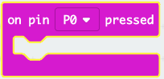

## विफलताओं का ट्रैक रखना

आइए हम विफलताओं का ट्रैक रखने के लिए कोड जोड़ें।

+ प्रत्येक बार Pin0 (पिन 0) पर जब कोई कनेक्शन बनाया जाएगा तो आप अपने `विफलताएँ` वेरिएबल में 1 जोड़ेंगे। ऐसा करने के लिए, 'Input' ('इनपुट') से `on pin P0 pressed` को खींचें।

+ इसके बाद, Pin0 (पिन 0) दबाए जाने पर 1 सेकंड के लिए क्रॉस प्रदर्शित करने के लिए 2 ब्लॉक जोड़ें।

+ फिर आपको अपने `विफलताएँ` वेरिएबल पर 1 जोड़ना होगा। ऐसा करने के लिए, Variables (वेरिएबल्स) से `change item by 1` (आइटम को 1 से बदलें) को क्लिक करें और खींचें और उसे बदलकर `item` (आइटम) की जगह `fail` (विफल) कर दें। 

+ अंत में, आप विफलताओं की अद्यतन संख्या प्रदर्शित करने के लिए कोड जोड़ सकते हैं। यहाँ दिखाया गया है कि आपका कोड कैसा दिखना चाहिए।

+ अपनी गेम को शुरू करने के लिए एमुलेटर पर बटन A दबाकर अपने कोड का परीक्षण करें। प्रत्येक बार जब आप Pin0 (पिन0) दबाते हैं तो आपको अपने `विफलताएँ` वेरिएबल में 1 की वृद्धि दिखाई देनी चाहिए।

+ 'Download' ('डाउनलोड') पर क्लिक करें और अपनी स्क्रिप्ट को अपने micro:bit पर स्थानांतरित करें। सर्किट को पूरा करके आप Pin0 (पिन0) को दबा सकते हैं। ऐसा करने के लिए, ground pin (ग्राउंड पिन) (GND) पर अपना दायाँ अंगूठा रखें और फिर अपने बाएँ अंगूठे से Pin0 (पिन0) टैप करें।

