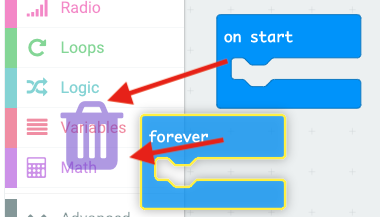
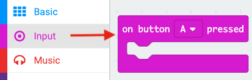

## Spremanje ne uspijeva

Započnimo s stvaranjem mjesta za pohranjivanje broja kvarova.

+ Idite na <a href="https://rpf.io/microbit-new" target="_blank">rpf.io/microbit-new</a> da biste pokrenuli novi projekt u MakeCode (PXT) uređivaču. Nazovite svoj novi projekt 'Frustracija'.

+ Izbrišite `zauvijek` i `start` bloka povlačenjem ih na paletu:

+ Nova igra trebala bi započeti kada igrač pritisne tipku A. Pritisnite "Unos", a zatim `na gumb A pritisnut`.

+ Sada vam je potrebna varijabla za spremanje broja pogrešaka u igri dodirom žice štapićem. Kliknite na 'Variables', a zatim na 'Make a new Variable'. Imenujte varijablu `ne uspije`.

+ Povucite blok od `skupa` iz "Varijable" i odaberite `neuspjeha`:

Kad pritisnete gumb A, postavit će se broj neuspjeha na nulu.

+ Konačno, možete prikazati broj `propusta` na vašem mikro: bitu. Da biste to učinili, prvo povucite blok `emisije broj` od "Osnovno" do kraja skripte.

+ Zatim povucite `ne uspije` iz "Varijable" u svoj `postavljeni blok`.

+ Kliknite "Pokreni" da biste testirali svoju skriptu. Klikom na gumb A treba se prikazati broj pogrešaka koji je postavljen na `0`.

