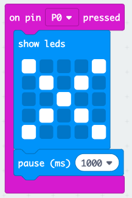
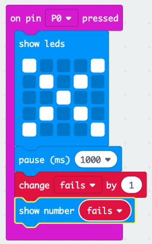

## Praćenje neuspjeha

Dodajmo kôd za praćenje kvarova.

+ Svaki put kad se uspostavi veza na Pin0, varijabli `ne uspije` dodati ćete 1. Da biste to učinili, povucite `na pin P0 pritisnut` s 'Ulaz'.

+ Zatim dodajte 2 bloka za prikaz križa na 1 sekundu kada pritisnete Pin0.

+ Tada ćete morati dodati 1 u varijablu `ne uspijeva`. Da biste to učinili, povucite stavku `promjenu 1` iz Varijable i promijenite `stavka` u `neuspjeh`. 

+ Konačno, možete dodati kôd za prikaz ažuriranog broja kvarova. Ovako bi tvoj kôd trebao izgledati.

+ Testirajte svoj kôd pritiskom na tipku A na emulatoru za početak igre. Svakim pritiskom Pin0 trebali vidjeti svoje `ne` varijabilni porast od 1.

+ Kliknite "Preuzmi" i prenesite skriptu na svoj mikro: bit. Možete pritisnuti Pin0 dovršenjem kruga. Da biste to učinili, postavite desni palac na zemaljsku iglu (GND), a zatim dodirnite Pin0 lijevim palcem.

