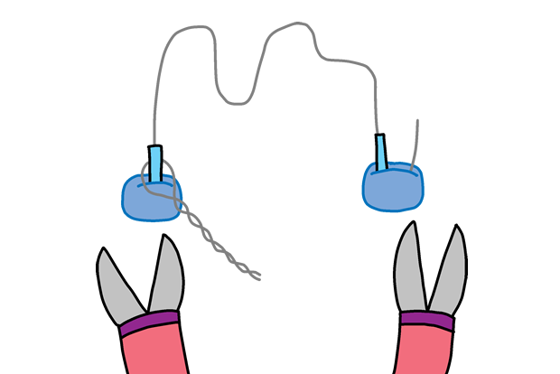
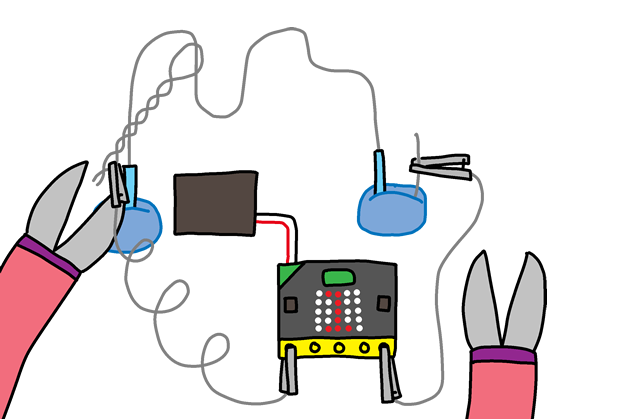

## Izgradnja svoje igre

Sad kad ste šifrirali svoju igru, pripremimo je zajedno!

+ Prvo, napravimo vaš štapić. Uzmite komad žice dugačak oko 20 cm i savijte ga na pola, čineći petlju na vrhu.

+ Zatim možete uviti dva komada žice zajedno.

+ Da biste napravili tečaj, uzmite još jedan komad žice duljine oko 30 cm i savijte srednji dio žice u oblik. Treba saviti jedan kraj tečaja.

+ Ako imate neku električnu vrpcu, omotajte je oko dva kraja žice, ostavljajući neki otkriveni metal na oba kraja.

+ Gurnite štapić svojim tokom i gurnite krajeve žice u nekakav kit da ga uspravite.

+ Sada možete spojiti igru na mikro: bit pomoću olovke za krokodile ili neke žice. Prvo spojite uzemljeni pin (GND) na jedan kraj vašeg tečaja.

+ Zatim možete spojiti Pin 0 na štapić.

+ Testirajte svoju igru. Pritisnite gumb A i rezultat treba biti postavljen na 0. Svaki put kada štapić dodirne tečaj, krug je dovršen i vaš micro: bit trebao bi dodati 1 vašem broju pogrešaka.

