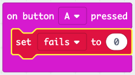
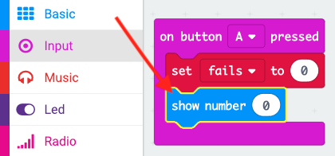
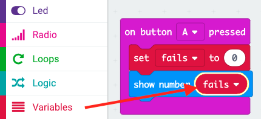

## ವಿಫಲ ಪ್ರಯತ್ನದ ವಿವರಗಳ ಸಂಗ್ರಹ

ವಿಫಲತೆಗಳ ಸಂಖ್ಯೆಯನ್ನು ಸಂಗ್ರಹಿಸಲು ಸ್ಥಳವನ್ನು ತಯಾರಿಸುವ ಮೂಲಕ ಪ್ರಾರಂಭಿಸೋಣ.

+ MakeCode (PXT) ಸಂಪಾದಕದಲ್ಲಿ ಹೊಸ ಪ್ರಾಜೆಕ್ಟನ್ನು ಪ್ರಾರಂಭಿಸಲು <a href="https://rpf.io/microbit-new" target="_blank">rpf.io/microbit-new</a>ಗೆ ಹೋಗಿ. ನಿಮ್ಮ ಹೊಸ ಪ್ರಾಜೆಕ್ಟನ್ನು 'ಫ್ರಸ್ಟ್ರೇಷನ್' ಎಂದು ಕರೆಯಿರಿ.

+ `forever` ಮತ್ತು `start` ಬ್ಲಾಕುಗಳನ್ನು ಪ್ಯಾಲೆಟ್‌ಗೆ ಎಳೆಯುವ ಮೂಲಕ ಅಳಿಸಿರಿ:

+ ಆಟಗಾರನು A ಗುಂಡಿಯನ್ನು ಒತ್ತಿದಾಗ ಹೊಸ ಆಟ ಪ್ರಾರಂಭವಾಗಬೇಕು. 'Input' ಕ್ಲಿಕ್ ಮಾಡಿ ಮತ್ತು ನಂತರ `on button A pressed`.

+ ದಂಡದ ಮೂಲಕ ತಂತಿಯನ್ನು ಸ್ಪರ್ಶಿಸುವ ಮೂಲಕ ನೀವು ಆಟದಲ್ಲಿ ಎಷ್ಟು ಬಾರಿ ವಿಫಲರಾಗುತ್ತೀರಿ ಎಂಬುದನ್ನು ಸಂಗ್ರಹಿಸಲು ಈಗ ನಿಮಗೆ ವೇರಿಯೇಬಲ್ ಅಗತ್ಯವಿದೆ. 'Variables' ಕ್ಲಿಕ್ ಮಾಡಿ ಮತ್ತು ನಂತರ 'Make a new Variable' ಕ್ಲಿಕ್ ಮಾಡಿ. ವೇರಿಯೇಬಲ್ ಅನ್ನು`fails` ಎಂದು ಹೆಸರಿಸಿ.

+ 'Variables' ನಿಂದ `set` ಬ್ಲಾಕನ್ನು ಎಳೆದು `fails` ಅನ್ನು ಆಯ್ಕೆ ಮಾಡಿ:

ನೀವು ಎ ಗುಂಡಿಯನ್ನು ಒತ್ತಿದಾಗ ಇದು ವಿಫಲತೆಗಳ ಸಂಖ್ಯೆಯನ್ನು ಶೂನ್ಯಕ್ಕೆ ಹೊಂದಿಸುತ್ತದೆ.

+ ಅಂತಿಮವಾಗಿ, ನೀವು `ವಿಫಲತೆಗಳ` ಸಂಖ್ಯೆಯನ್ನು ನಿಮ್ಮ micro:bit ನಲ್ಲಿ ಪ್ರದರ್ಶಿಸಬಹುದು. ಇದನ್ನು ಮಾಡಲು `show number` ಬ್ಲಾಕನ್ನು 'Begin' ನಿಂದ ಎಳೆದು ನಿಮ್ಮ ಸ್ಕ್ರಿಪ್ಟ್ ನ ಕೊನೆಯಲ್ಲಿ ಹಾಕಿರಿ.

+ ತದನಂತರ `fails` ನ್ನು 'Variables' ನಿಂದ `set block` ಗೆ ಎಳೆಯಿರಿ.

+ ನಿಮ್ಮ ಸ್ಕ್ರಿಪ್ಟ್ ನ್ನು ಪರೀಕ್ಷಿಸಲು 'run' ಕ್ಲಿಕ್ ಮಾಡಿ. ಬಟನ್ ಕ್ಲಿಕ್ ಮಾಡುವುದರಿಂದ ವಿಫಲತೆಗಳ ಸಂಖ್ಯೆಯನ್ನು ಪ್ರದರ್ಶಿಸಬೇಕು, ಈ ಸಮಯದಲ್ಲಿ ಅದು `ಸೊನ್ನೆ`ಯಾಗಿರುವುದು.

