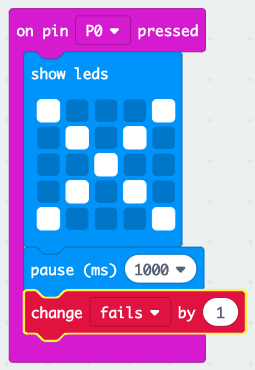

## ವಿಫಲತೆಗಳ ಜಾಡನ್ನು ಇಡುವುದು

ವಿಫಲತೆಗಳ ಜಾಡನ್ನು ಇರಿಸಲು ಕೋಡ್ ಅನ್ನು ಸೇರಿಸೋಣ.

+ ಪ್ರತಿ ಬಾರಿ pin0 ದಲ್ಲಿ ಸಂಪರ್ಕ ಬಂದ ಒಡನೇ ನೀವು `fails` ವೇರಿಯೇಬಲ್ ಗೆ ಒಂದನ್ನು ಸೇರಿಸಲಿದ್ದೀರಿ. ಇದನ್ನು ಮಾಡಲು, 'Input' ನಿಂದ `on pin P0 pressed` ನ್ನು ಎಳೆಯಿರಿ.

+ ಮುಂದೆ, ಪಿನ್ 0 ಒತ್ತಿದಾಗ 1 ಸೆಕೆಂಡಿಗೆ ಗುಣಿಸು ಚಿಹ್ನೆಯನ್ನು ಪ್ರದರ್ಶಿಸಲು 2 ಬ್ಲಾಕ್‌ಗಳನ್ನು ಸೇರಿಸಿ.

+ ಇದಾದ ಮೇಲೆ `fails` ವೇರಿಯೇಬಲ್ ಗೆ ಒಂದನ್ನು ಸೇರಿಸಬೇಕು. ಇದನ್ನು ಮಾಡಲು ವೇರಿಯೇಬಲ್ಸ್ ನಿಂದ `change item by 1` ನ್ನು ಎಳೆದು `item` ಬದಲಿಗೆ `fail` ಉಪಯೋಗಿಸಿ. 

+ ಅಂತಿಮವಾಗಿ, ಪ್ರಸ್ತುತ ವಿಫಲತೆಗಳ ಸಂಖ್ಯೆಯನ್ನು ಪ್ರದರ್ಶಿಸಲು ನೀವು ಕೋಡ್ ಅನ್ನು ಸೇರಿಸಬಹುದು. ನಿಮ್ಮ ಕೋಡ್ ಹೇಗೆ ಕಾಣಬೇಕು ಎಂಬುದು ಇಲ್ಲಿದೆ.

+ ನಿಮ್ಮ ಕೋಡ್ ನ್ನು ಪರೀಕ್ಷಿಸಲು ಬಟನ್ ಒತ್ತುವ ಮೂಲಕ ಆಟ ಆರಂಭಿಸಿ. ಪ್ರತಿ ಬಾರಿ ನೀವು Pin0 ಅನ್ನು ಒತ್ತಿದಾಗ ನಿಮ್ಮ `fails` ವೇರಿಯೇಬಲ್ ನಲ್ಲಿ ಒಂದರಂತೆ ಹೆಚ್ಚಳ ಆಗುವುದು.

+ 'Download' ಕ್ಲಿಕ್ ಮಾಡಿ ಮತ್ತು ನಿಮ್ಮ ಸ್ಕ್ರಿಪ್ಟ್ ಅನ್ನು ನಿಮ್ಮ micro:bit ಗೆ ವರ್ಗಾಯಿಸಿ. ಸರ್ಕ್ಯೂಟ್ ಅನ್ನು ಪೂರ್ಣಗೊಳಿಸಲು ನೀವು Pin0 ಅನ್ನು ಒತ್ತಿರಿ. ಇದನ್ನು ಮಾಡಲು, ನಿಮ್ಮ ಬಲ ಹೆಬ್ಬೆರಳನ್ನು ಗ್ರೌಂಡ್ ಪಿನ್ (ಜಿಎನ್‌ಡಿ) ಮೇಲೆ ಇರಿಸಿ ಮತ್ತು ನಂತರ ನಿಮ್ಮ ಎಡ ಹೆಬ್ಬೆರಳಿನಿಂದ pin0 ಒತ್ತಿರಿ.

