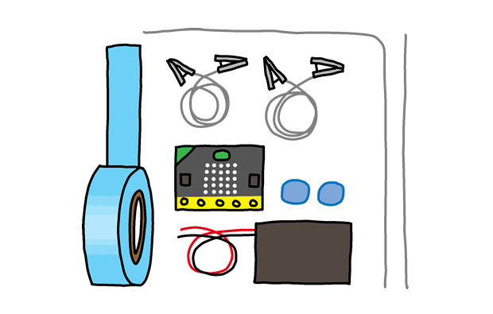

## Inleiding

Je gaat een spel maken waarin spelers een ring langs een spiraal moeten leiden zonder contact te maken. Als je contact maakt, krijgt de andere speler een punt. De speler met de laagste score wint!

**Instructies**: Als je dit online leest, klik hieronder op **A** op de micro:bit om het spel te starten, en klik op pin **0** om een verbinding te maken.

<iframe style="position:absolute;top:0;left:0;width:100%;height:100%;" src="https://makecode.microbit.org/---run?id=_FEDEdA3v6e64" allowfullscreen="allowfullscreen" sandbox="allow-popups allow-scripts allow-same-origin" frameborder="0"></iframe>

Voor dit project heb je extra materiaal nodig:

* Metalen draad (ongeveer 50cm);
* Boetseerklei (of iets dergelijks, mag niet-geleidend zijn);
* Isolatietape (optioneel);
* Krokodillenklemmen (optioneel).

### Aanvullende informatie voor clubleiders

Als je dit project wilt afdrukken, gebruik dan de [printervriendelijke versie](https://projects.raspberrypi.org/en/projects/frustration/print).

## \--- collapse \---

## title: Clubleider notities

## Inleiding:

Tijdens dit project leren kinderen hoe ze met variabelen een spel maken waarin ze een draad volgen. Het doel van het spel is om een ring langs een spiraal te leiden zonder contact te maken. Als je contact maakt, krijgt de andere speler een punt. De speler met de laagste score wint.

## Bronnen

Om dit project te voltooien, hebben kinderen het volgende nodig:

* Metalen draad (ongeveer 50cm);
* Boetseerklei;
* Isolatietape (optioneel);
* Krokodillenklemmen (optioneel).

Stappen 1 en 2 van dit project kunnen zonder deze items worden voltooid.

Maak voor dit project gebruik van de [MakeCode (PXT)](http://jumpto.cc/pxt-new) microbit-editor.

Je kunt een voltooide versie van dit project vinden op [makecode.microbit.org/#pub:71088-38400-20107-39742](https://makecode.microbit.org/#pub:71088-38400-20107-39742). Het gecompileerde .hex-bestand kan worden gedownload door te klikken op de link 'Projectmaterialen downloaden' voor dit project, dat bevat:

* Frustration.hex

## Leerdoelen

* Variabelen;
* Input/output (I/O) pinnen.

Dit project behandelt elementen uit de volgende onderdelen van het [Raspberry Pi Digital Making Curriculum](http://rpf.io/curriculum):

* [Gebruik eenvoudige programmeerconstructies om simpele programma's te maken.](https://www.raspberrypi.org/curriculum/programming/creator)

* [Gebruik standaard digitale, analoge en elektromechanische componenten.](https://www.raspberrypi.org/curriculum/physical-computing/creator)

## Uitdagingen

* "Een afbeelding weergeven" - Gebruik de micro:bit om een afbeelding weer te geven voordat het aantal `mislukkingen` verschijnt.
* "Vals speel modus!" - Trek 1 af van de `mislukkingen` variabele wanneer knop B wordt ingedrukt.
* "Personaliseer je spel" - Breng wijzigingen aan op de ring en de baan om het spel moeilijker te maken.

\--- /collapse \---

## \--- collapse \---

## title: Projectmaterialen

## Club leider middelen

* [online voltooid project](https://makecode.microbit.org/#pub:71088-38400-20107-39742)
* [.hex projectbestand om over te zetten naar je micro:bit](resources/micro-bit-Frustration.hex)

\--- /collapse \---