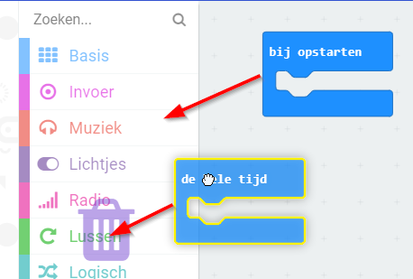
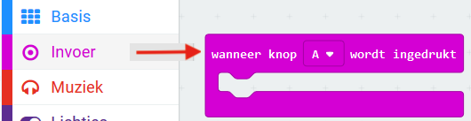
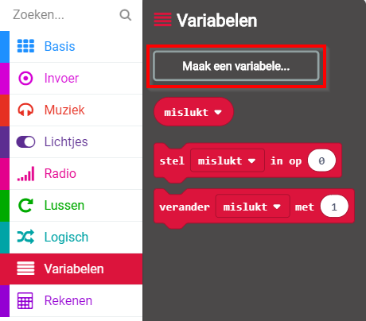
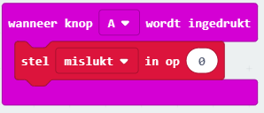
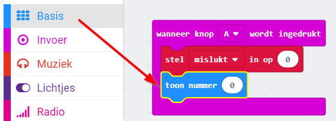
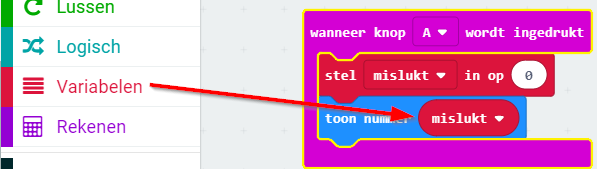
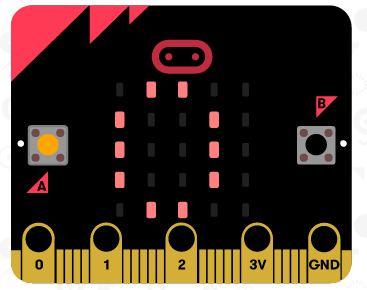

## Mislukkingen opslaan

Laten we beginnen met het creëren van een plaats om het aantal mislukkingen op te slaan.

+ Ga naar <a href="https://rpf.io/microbit-new" target="_blank">rpf.io/microbit-new</a> om een nieuw project te starten in de MakeCode (PXT) editor. Noem je nieuwe project 'Zenuwspiraal'.

+ Verwijder de `de hele tijd` en `bij opstarten` blokken door ze naar de commando-lijst te slepen:

+ Een nieuw spel zou moeten beginnen wanneer de speler op knop A drukt. Klik op 'Invoer' en vervolgens `wanneer knop A wordt ingedrukt`.

+ Nu heb je een variabele nodig om het aantal keren dat je in het spel mislukt op te slaan. Klik op 'Variabelen' en vervolgens op 'Maak een variabele....'. Noem de variabele `mislukt`.

+ Sleep een `stel in op 0` blok vanuit 'Variabelen' en selecteer `mislukt`:

Hiermee wordt het aantal mislukkingen op nul gezet wanneer je op de A-knop drukt.

+ Ten slotte kun je het aantal keren `mislukt` weergeven op je micro:bit. Om dit te doen, sleep een `toon nummer` blok van 'Basis' naar het einde van je script.

+ Sleep hierna `mislukt` van 'Variabelen' naar je `toon nummer blok`.

+ Klik op 'start' om je script te testen. Door op de A-knop te klikken geef je het aantal mislukkingen weer, dit is ingesteld op `0`.

