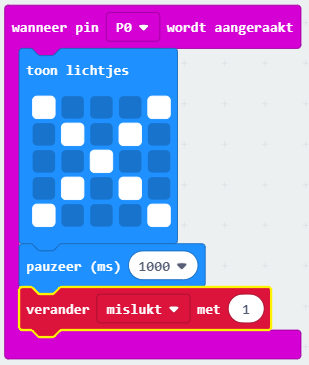

## Het bijhouden van mislukkingen

Laten we code toevoegen om de mislukkingen bij te houden.

+ Je gaat 1 toevoegen aan je `mislukt` variabele telkens wanneer een verbinding wordt gemaakt op Pin0. Sleep hiervoor `wanneer pin P0 wordt aangeraakt ` uit 'Invoer'.

+ Voeg vervolgens 2 blokken toe om een kruisje gedurende 1 seconde weer te geven wanneer Pin0 wordt ingedrukt.

+ Je moet dan 1 toevoegen aan je `mislukt` variabele. Klik en sleep hiervoor vanuit Variabelen een `verander mislukt met 1` blok. 

+ Tot slot kun je code toevoegen om het bijgewerkte aantal mislukkingen weer te geven. Zo zou de code eruit moeten zien.

+ Test je code door op knop A te drukken op de emulator om je spel te starten. Elke keer dat je op Pin0 drukt, moet je je `mislukt` variabele met 1 zien toenemen.

+ Klik op 'Downloaden' en verplaats je script naar de micro:bit. Je kunt op Pin0 drukken om een verbinding te maken. Plaats hiervoor je rechterduim op de aardpin (GND) en tik vervolgens met je linkerduim op Pin0.

