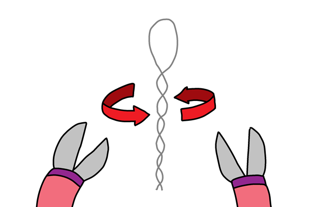
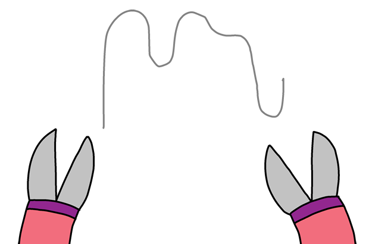

## Je spel bouwen

Laten we nu je je spel hebt gecodeerd, het in elkaar zetten!

+ Laten we eerst je ring maken. Neem een stuk draad van ongeveer 20 cm lang en buig het in tweeën, maak een ring aan de bovenkant.

+ Daarna draai je de twee stukken draad in elkaar.

+ Om de spiraal te maken, neem je nog een stuk draad van ongeveer 30 cm lang en buigt je het middelste deel van de draad in een spiraal. Je moet één einde van de spiraal naar omhoog buigen.

+ Als je isolatietape hebt, kun je dit rond de twee uiteinden van de draad winden maar laat aan beide kanten een deel van het metaal bloot liggen.

+ Schuif je ring over de spiraal en duw de uiteinden van je draad in de modelleerklei om het rechtop te houden.

+ Je kunt nu je spel verbinden met je micro:bit met behulp van een krokodil klemmen of een draad. Sluit eerst de aardpin (GND) aan op een uiteinde van je spiraal.

+ Daarna kun je Pin 0 met je spiraal verbinden.

+ Test je spel. Druk op knop A en je score zal op 0 ingesteld worden. Elke keer dat je ring de spiraal raakt, is het circuit gesloten en zal je micro:bit 1 punt toevoegen aan je aantal mislukkingen.

