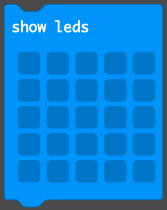

\--- challenge \---

## Challenge: Display an image

Can you display an image for 1 second (1000ms) before the number of `fails` are displayed?

You'll need to use the following blocks from Basic do to this:

\--- /thử thách \---